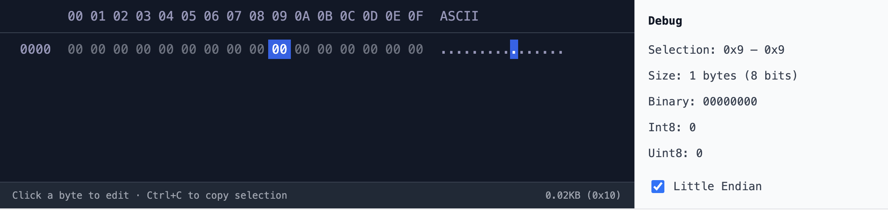

# react-hex-viewer

A React component to display and edit hex data.



## Install

```sh
npm install @malsuke/react-hex-viewer
```

or

```sh
yarn add @malsuke/react-hex-viewer
```

or

```sh
pnpm add @malsuke/react-hex-viewer
```

## Usage

### Basic Usage

```tsx
import { HexViewer } from '@malsuke/react-hex-viewer'

export default function App() {
  return (
    <HexViewer
      hexString="48656c6c6f2c20576f726c642120f09f918b"
      editable={true}
      showDebugPanel={true}
    />
  )
}
```

### With Next.js (next/font)

For the best experience, it is recommended to use a monospace font. If you are using Next.js, you can use `next/font` to load a font and pass it to the `fontFamily` prop.

```tsx
import { JetBrains_Mono } from 'next/font/google'
import { HexViewer } from '@malsuke/react-hex-viewer'

const jetbrainsMono = JetBrains_Mono({
  subsets: ['latin'],
  display: 'swap',
})

export default function Page() {
  return (
    <HexViewer
      hexString="48656c6c6f2c20576f726c642120f09f918b"
      fontFamily={jetbrainsMono.style.fontFamily}
    />
  )
}
```

## Props

| Property | Type | Default | Description |
| --- | --- | --- | --- |
| `hexString` | `string` | `'00000000000000000000000000000000'` | The hex string to display (2 characters = 1 byte). |
| `fontFamily` | `string` | `undefined` | The font family to use for the hex viewer. |
| `showDebugPanel` | `boolean` | `true` | Whether to show the debug panel on the right side. |
| `editable` | `boolean` | `true` | Whether the hex values can be edited. |
| `className` | `string` | `''` | Additional CSS class for the root container. |
